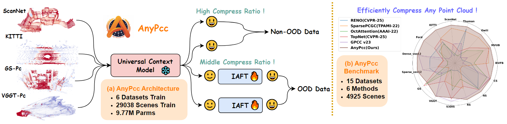

<h1 align="center">AnyPcc: Compressing Any Point Cloud with a Single Universal Model </h1>

<p align="center">
    <strong><a href="https://github.com/Wangkkklll">Kangli Wang</a></strong><sup>1</sup>,
    <strong><a href="https://github.com/GongsunBABA">Qianxi Yi</a></strong><sup>1,2</sup>, 
    <strong><a href="https://shihao-homepage.com">Yuqi Ye</a></strong><sup>1</sup>,
    <strong><a href="https://github.com/GongsunBABA">Shihao Li</a></strong><sup>1</sup>,
    <strong><a href="https://gaowei262.github.io/">Wei Gao</a></strong><sup>1,2*</sup><br>
    (<em>* Corresponding author</em>)
</p>

<p align="center">
    <sup>1</sup>SECE, Peking University<br>
    <sup>2</sup>Peng Cheng Laboratory, Shenzhen, China
</p>
<p align="center">
  <a href="https://arxiv.org/abs/2510.20331"></a>
  <a href="https://github.com/Wangkkklll/AnyPcc?tab=MIT-1-ov-file"></a>
  <a href="https://anypcc.github.io/"></a>
</p>

> **TL;DR:** AnyPcc compress **any source** point cloud with a single universal model.  

## 📣 News
- [25-10-24] 🔥 We initially released the paper and project.
- [26-02-21] 🔥 Congratulations on the acceptance of AnyPcc to CVPR 2026!
- [26-02-24] 🔥 Complete training and testing code and pre-trained checkpoint of AnyPcc have been released. check it out！

## Todo
- Release all dataset

## Links
Our work on point cloud or 3DGS compression has also been released. Welcome to check it.
- 🔥 [UniPCGC](https://uni-pcgc.github.io/) [AAAI'25]: A unified point cloud geometry compression. [[`Paper`](https://ojs.aaai.org/index.php/AAAI/article/view/33387)] [[`Arxiv`](https://arxiv.org/abs/2503.18541)] [[`Project`](https://uni-pcgc.github.io/)]
- 🔥 [GausPcc](https://gauspcc.github.io/) [Arxiv'25]: Efficient 3D Gaussian Compression ! [[`Arxiv`](https://arxiv.org/abs/2505.18197)] [[`Project`](https://gauspcc.github.io/)]


## 📌 Introduction

Generalization remains a critical challenge for deep learning-based point cloud geometry compression. We argue this stems from two key limitations: the lack of robust context models and the inefficient handling of out-of-distribution (OOD) data. To address both, we introduce AnyPcc, a universal point cloud compression framework. AnyPcc first employs a Universal Context Model that leverages priors from both spatial and channel-wise grouping to capture robust contextual dependencies. Second, our novel Instance-Adaptive Fine-Tuning (IAFT) strategy tackles OOD data by synergizing explicit and implicit compression paradigms. It fine-tunes a small subset of network weights for each instance and incorporates them into the bitstream, where the marginal bit cost of the weights is dwarfed by the resulting savings in geometry compression. Extensive experiments on a benchmark of 15 diverse datasets confirm that AnyPcc sets a new state-of-the-art in point cloud compression. Our code and datasets will be released to encourage reproducible research.

<div align="center">

<br>
Ilustration of the proposed framework. 
</div>

## 🔑 Setup
The code has been tested on **Ubuntu** with **Python 3.10**, **PyTorch 2.4.0**, and **CUDA 12.1**. Furthermore, our environment requires very few libraries, so even lower versions of CUDA and Torch are acceptable. Configure the environment as follows.

```
# 1. Clone the repository
git clone [https://github.com/Wangkkklll/AnyPcc.git](https://github.com/Wangkkklll/AnyPcc.git)
cd AnyPcc

# 2. Create and activate conda environment
conda create -n anypcc python=3.10 -y
conda activate anypcc

# 3. Install PyTorch (CUDA 12.1)
pip install torch==2.4.0 torchvision==0.19.0 torchaudio==2.4.0 --index-url [https://download.pytorch.org/whl/cu121](https://download.pytorch.org/whl/cu121)

# 4. Install specific dependencies directly via Git
pip install git+[https://github.com/mit-han-lab/torchsparse.git](https://github.com/mit-han-lab/torchsparse.git)
pip install git+[https://github.com/fraunhoferhhi/DeepCABAC.git](https://github.com/fraunhoferhhi/DeepCABAC.git)

# 5. Install other requirements
pip install torchac
pip install -r requirements.txt
```
## 🧩 Dataset Preparation and Pretrained Model
The training sets we used include 8iVFB, MVUB, KITTI, Ford, ScanNet, Thuman, and GausPcc-1K. Please refer to the training and testing config files for specific details. The dataset configurations and our custom datasets will be open-sourced in the future.

Please refer to the following [Link](https://pan.baidu.com/s/1YAB4sbHxkOVEU5jOc2KxEg?pwd=875r) to obtain the pretrained models and dataset (soon).

## 🚀 Running

### Training
```
# train for lossless unified model
script/train/ucm_u.sh
# train for lossy model
script/train/ucm_1stage_u.sh
# other single model see the script/train
```

### Testing

Before compression, all point clouds need to be quantized. Quantization parameters include `preprocess_scale`, `preprocess_shift`, and `posQ`. The quantization formula is `torch.round((xyz/preprocess_scale + preprocess_shift) / posQ)`.

```
# test for all dataset for lossless compression
script/test/ucm_u_all.sh

# test for dense point cloud for lossy compression
script/test/ucm_u_lossy.sh

# test for sparse point cloud for lossy compression
script/test/ucm_u_all.sh (set posQ!=1 for Quantization lossy compression)

# test for OOD data using IAFT
script/test/ucm_u_tune.sh
```

### Compress and Decompress
Please refer to the parameter settings in the compress_decompress.sh

```
script/test/compress_decompress.sh
```


## 🔎 Contact
If your have any comments or questions, feel free to contact [kangliwang@stu.pku.edu.cn](kangliwang@stu.pku.edu.cn).

## 📘 Citation
Please consider citing our work as follows if it is helpful and star our repo.
```bibtex
@article{wang2025anypcc,
  title={AnyPcc: Compressing Any Point Cloud with a Single Universal Model},
  author={Wang, Kangli and Yi, Qianxi and Ye, Yuqi and Li, Shihao and Gao, Wei},
  journal={arXiv preprint arXiv:2510.20331},
  year={2025}
}
```
